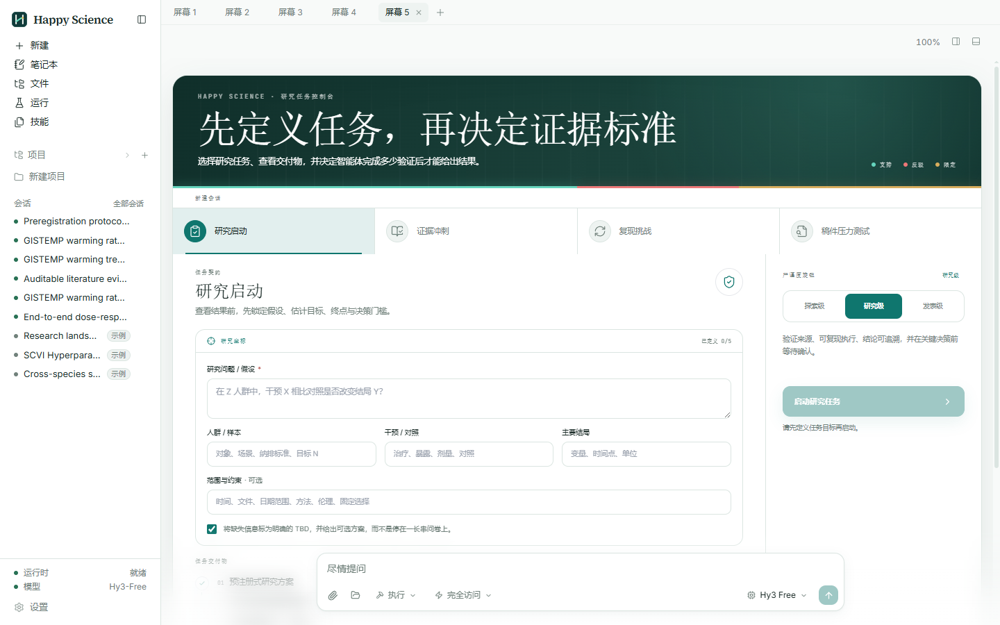
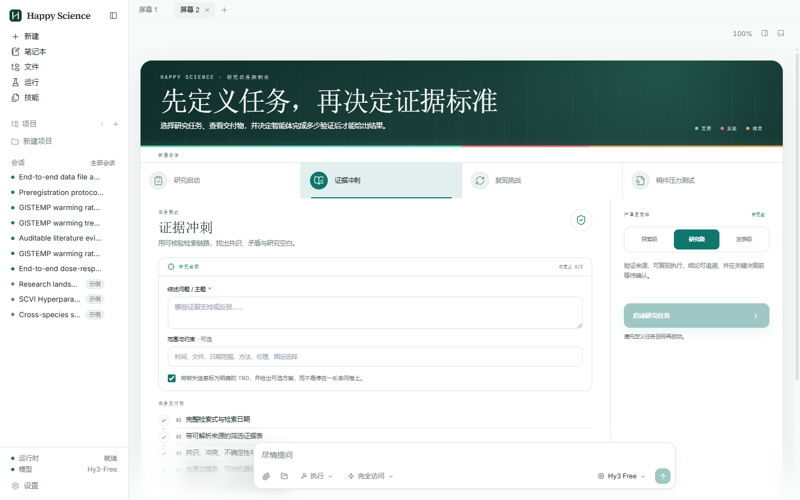

<div align="center">


# Happy Science

**macOS、Windows & Linux 向けのローカルファースト、モデル非依存 AI 研究ワークベンチ。**

Happy Science は、MIT ライセンスの [Open Science Desktop](https://github.com/ai4s-research/open-science) を基盤にした独立した製品フォークです。Tauri、MCP、agent skills、再現可能な成果物を基盤に、エージェント、ノートブック、ファイル、図、レポート、実行記録、レビューを 1 つの監査可能なデスクトップワークフローにまとめます。

<p>
  <a href="./README.md">English</a> ·
  <a href="./README.zh.md">简体中文</a> ·
  <b>日本語</b> ·
  <a href="./README.es.md">Español</a> ·
  <a href="./README.de.md">Deutsch</a> ·
  <a href="./README.fr.md">Français</a> ·
  <a href="./README.ko.md">한국어</a>
</p>

<p>
  <a href="./LICENSE"></a>
  <a href="https://doi.org/10.5281/zenodo.21351225"></a>
  <a href="https://internscience.github.io/ResearchClawBench-Home/"></a>
  
  
  
  
  <a href="https://discord.gg/fWNMDKcd5P"></a>
</p>

</div>

---

## ニュース

- **2026-08-18** — 🖥️ **画面がなくても動き、ターミナルのコマンドも同梱。** `osd server` はディスプレイのないマシンでワークベンチ一式（ワークスペース、エージェントランタイム、そして*同じ* Web UI）を起動し、`osd session send … --wait` でスクリプトや別のエージェントから動かせます。`osd` はデスクトップのインストーラーに入り、初回起動で PATH に載ります。サーバーではアーカイブだけで、追加インストールは不要です。モデル・鍵・承認はすべてターミナルから設定できます（`osd model`、`osd auth`、`osd approval`）。
- **2026-08-13** — 🔌 **Agent Client Protocol に双方向で対応。** Codex、Gemini CLI、Claude Code などの ACP エージェントを、そのエージェント自身のモデル・履歴と本アプリの MCP コネクタごと、このアプリの中から動かせます。逆に Zed、JetBrains、Neovim から Open Science を動かすこともできます。 *(v0.4.0)*
- **2026-08-01** — 🗂️ **プロジェクト・メモリ・全履歴。** セッションを名前付きプロジェクトにまとめ（既存リポジトリはコピーせず**その場で**インポート）、グローバルとプロジェクトの永続メモリを持たせ、過去のすべての会話を検索可能な履歴（アーカイブ／復元／エクスポート付き）から辿れます。 *(v0.3.1)*
- **2026-07-24** — 🪟 **分割ペインのタイリング。** セッションを並べて表示し、ペインをドラッグして再配置し、独立した「スクリーン」を複数保持でき、ペインごとに別のモデルを使えます。 *(v0.3.0)*
- **2026-07-21** — 🌐 **どこからでもアクセス——スマホからでも。** トークン認証ゲートウェイが*本物の*デスクトップ UI を CLI、LAN 上のブラウザ、あるいはスマホへ配信します（既定はループバック、LAN はオプトイン）。デスクで実行を開始し、完成した図とレポートをスマホで読めます。 *(v0.2.3)*
- **2026-07-21** — 🧭 **ブラウザ制御。** エージェントがあなた自身の Chrome を——プロファイルとログインを保ったまま——操作し、あなたと同じようにライブな Web を読み取ります。必要に応じて分離されたプライベートブラウザも使えます。 *(v0.2.3)*
- **2026-07-09** — 🎉 **ResearchClawBench 第 1 位。** Open Science Desktop は、自律型科学研究エージェント向けのエンドツーエンドベンチマーク [ResearchClawBench](https://internscience.github.io/ResearchClawBench-Home/) で、採点済みタスク平均スコア第 1 位です（Pass@1 リーダーボード）。

---

## 目次

- [✨ できること](#できること)
- [🎬 スクリーンショット](#スクリーンショット)
- [🧪 現在の機能](#現在の機能)
- [🔌 スキルとコネクタ](#スキルとコネクタ)
- [📦 インストール](#インストール)
- [🖥️ ヘッドレスと CLI(`osd`)](#ヘッドレスと-cliosd)
- [🚀 ソースからビルド](#ソースからビルド)
- [🔒 安全性とプライバシー](#安全性とプライバシー)
- [🗂️ リポジトリ構成](#リポジトリ構成)
- [📌 状態](#状態)

## できること

**研究ループをまるごと回す**——広い方向性から完成論文まで:探索、文献調査、仮説、実験コード、分析、作図、執筆を、1 回の連続した監査可能なセッションで。

- **自律型リサーチエージェント**: バンドルされた `ai4s-agent` が専門スキルをエンドツーエンドで連結し(探索 → 調査 → 実験 → 執筆)、各ステップが単なるチャット返信ではなく、実在する検査可能な成果物をワークスペースに残します。
- **すべてが辿れる**: 図、表、レポート、ノートブック、実行出力は、それらを生成した正確なコード、入力、環境、モデル出力、会話へリンクします。
- **ローカルファースト、あなたのもの**: セッション、データ、来歴、ノートブック、実行記録はすべて手元のローカルフォルダに保存され、既定では外部に出ません。
- **モデル非依存ランタイム**: UI は `packages/sdk` 経由でバンドル済み OpenCode sidecar と通信します——好きなモデルを持ち込めます。プロバイダ、スキル、MCP サーバーは差し替え可能です。
- **設計から再現可能**: ローカル、SSH/Slurm、Modal、notebook-batch の実行を、散らばった端末ログではなく再現可能な run record として記録します。
- **どこからでも届く**: 組み込みのトークン認証ゲートウェイが*本物の*デスクトップ UI を LAN 上のブラウザやスマホへ配信します（トンネルを使えばどこからでも）——デスクで実行を開始し、昼休みにスマホから様子を確認できます。既定ではオフで、オプトインするまではループバック限定。API キーがマシンから出ることはありません。
- **あなた自身のブラウザを操作**: エージェントはあなた自身の Chrome を、プロファイルとログインを保ったまま制御し、あなたと同じようにライブな Web を読み取れます——あるいは、そうしたくないときは分離されたプライベートブラウザを使います。
- **拡張可能**: エージェントスキル、MCP サーバーとワンクリックの科学コネクタ、`/` コマンド、`!` shell モード、そしてモデル非依存の SDK。

## スクリーンショット

この 2 枚は、このリポジトリからビルドした Happy Science の実際の Windows 画面です。上流プロジェクトの画像ではありません。

**Research Launch — エージェント実行前に研究契約を定義。** 質問、対象集団、介入、アウトカム、制約を入力し、右側で厳密度と必須成果物を確認します。



**Evidence Sprint — 主張を支持または反証する証拠を確認。** 完了前に、検索記録、出典付き証拠表、競合レビュー、ハッシュ付きソーススナップショットを要求します。



## 現在の機能

**研究ループをスキルとして。** 1 つのメタスキルがパイプライン全体を実行し、各ステージは自己完結したスキルとして、実在する評価可能な成果物を生成します——OpenCode が対応する任意のモデルで動きます:

| スキル | 役割 | 主な成果物 |
| --- | --- | --- |
| `ai4s-agent` | 下の 4 スキルを順に実行 | 研究パッケージ一式 |
| `research-explorer` | 広い方向性を具体的なテーマへ収束 | `research_exploration.md`、`topic_matrix.md`、`literature_pre_survey.md` |
| `literature-survey` | 文献調査を執筆 | 6–20 頁 PDF、60+ の実引用、LaTeX ソース、分類図 |
| `experiment-suite` | 実験パッケージを構築 | 設計文書、実行可能コード、来歴付き `results.json`、図、レポート |
| `paper-writer` | 研究論文を執筆 | 8–14 頁 PDF、200+ 引用、4–8 図、表 |
| `mindmap-render` | マインドマップを描画 | `topic_matrix.md` から生成した画像 |
| `integrity-auditor` | 論文の整合性を監査 | 画像/数値/論理の指摘、4 段階の証拠グレーディング、`audit_report.md` |

これらは `ai4s-skills` パックとして、第一者のレビュースキルおよび下記の Office/ドキュメントスキルとともに提供されます。

### プラットフォーム

| 領域 | 現在の状態 |
| --- | --- |
| デスクトップ | Tauri 2 + React + TypeScript + Vite。macOS、Windows、Linux のビルド対象。 |
| ランタイム | アプリが自動起動するバンドル済み OpenCode sidecar。ユーザー自身の OpenCode 設定/データとは分離。 |
| プロジェクト | セッションをまとめる名前付きプロジェクト。既存フォルダをその場でインポート（コピーしない）、ワークスペース内の既存フォルダの取り込み、既存セッションのプロジェクトへの移動。 |
| セッション | 複数セッション、履歴、日時付きワークスペース、検索可能な履歴（アーカイブ／復元／エクスポート）、`@` ファイル参照と `#` 会話参照、`/` コマンド、`!` shell モード。 |
| レイアウト | N 分割のペインタイリング、ドラッグでの再ドック、独立した複数スクリーン、ペインごとのモデルと推論強度、スクリーン間のペインドラッグ。 |
| エージェントモード | `/plan`（計画してから実行）、`/goal`（目的と受入基準）、専用パネルでのサブエージェント状況、ランタイムの実サーバー状態を反映する停止。 |
| メモリ | グローバルとプロジェクトの 2 層メモリ（切替可能）、モデルのコンテキスト窓に近づくと自動でコンテキストを圧縮。 |
| リモート計算 | `~/.ssh/config` からマシンを登録し、疎通を確認し、ジョブの投入・追跡・キャンセルをアプリ内から実行。 |
| 外観 | Light / Warm / Dark の 3 テーマ（テーマ別アクセント）と UI ズーム。 |
| ファイル | グローバル/セッション内のファイルブラウズ、右クリック操作、外部アプリで開く、パスコピー、ローカルプレビューサーバー。 |
| ヘッドレスと CLI | `osd server` はウィンドウなしでワークベンチを動かします（同じワークスペース、同じランタイム、同じ Web UI を、自己完結したディレクトリひとつから配信）。`osd` はそれを（あるいは動作中のデスクトップアプリを）ターミナルから操作します: セッション、プロジェクト、実行履歴、ファイル、承認、`--wait`、`--json`。 |
| リモートアクセス | 本物の UI を CLI、LAN 上の Web ブラウザ、またはスマホへ配信するトークン認証ゲートウェイ（既定はループバック、LAN はオプトイン）。読み取り専用/フルアクセスの各モード。トークンを埋め込んだリンクをコピーし、ワンタップで接続。API キーが通信路を渡ることはありません。 |
| エディタ連携（ACP） | Agent Client Protocol に双方向で対応：任意の ACP エージェント（Codex、Gemini CLI、Claude Code など）を通常の UI の背後のランタイムとして動かし、そのエージェント自身のモデル／推論レベルの選択、履歴の再生、本アプリの MCP コネクタをそのまま使えます。逆に外部エディタ（Zed、JetBrains、Neovim など）がゲートウェイのトークンを再利用して Open Science を駆動することもできます。 |
| ブラウザ制御 | エージェントがあなた自身の Chrome を——プロファイルとログイン状態を保ったまま——操作し、アクセシビリティツリーを通じてページを読み取ります。必要に応じて分離された/プライベートなブラウザも使えます。 |
| ノートブック | 実際の `.ipynb`、Python/R ノートブック作成、ローカルカーネル実行、バンドル `uv` による Jupyter 環境、JupyterLab 起動。 |
| 実行記録 | 追記型 run log、グローバル SQLite インデックス、検索/ファセット/ページング、出力リンク、ログ、再現プロンプト。 |
| 来歴 | `.openscience/provenance.jsonl` がファイル版を記録し、成果物を作成元の実行または編集へ結びます。 |
| ビューア | PDF、画像、動画、HTML、Markdown、コード、CSV/TSV とチャート、DOCX、XLSX、PPTX、分子、3D mesh、ゲノム、FITS、DOS/DOSCAR、EIGENVAL bands、qcode、異常マップ、phase。 |
| UI 言語 | English、简体中文、日本語、Español、Deutsch、Français、한국어。Portuguese (Brazil) と Arabic は登録済みですが、まだ選択可能ではありません。 |

## スキルとコネクタ

ビルド時に `ai4s-skills`、`anthropics/skills` の `docx`/`pdf`/`pptx`/`xlsx`、および `runtime/skills/core/` の第一者スキルを取得します。コアスキルには `traceability-review`、`stats-integrity`、`domain-check`、`large-file`、`publication-figures`、`remote-compute`、`modal-run` が含まれます。

ワンクリック科学 MCP コネクタ: 文献検索、Biomedical databases、Materials Project、FRED、Space weather、Open-Meteo、USGS water data。任意のローカル/リモート MCP サーバーも Settings から追加できます。

## インストール

[Releases](https://github.com/xwmxcz/happy-science/releases/latest) から最新版をダウンロードしてください。

- **macOS**: ソースからのビルドに対応していますが、このプレビューに署名済みインストーラーは含まれません。
- **Windows**: NSIS `.exe`、Windows 10/11 x64 — ユーザーごとにインストールされ、管理者権限は不要です。IT 部門による一括配布向けに `.msi` も配布しています。どちらか一方に統一してください。
- **Linux**: x86_64 Linux 向け `.deb` と `.rpm`。

現在の Happy Science プレビューでは、未署名の Windows および Linux パッケージを公開しています。

Windows では SmartScreen の **More info -> Run anyway** を選択します。

## ヘッドレスと CLI(`osd`)

研究用マシンにはたいてい画面がありません。`osd` は画面のない同じワークベンチです。ワークスペースの構成も、エージェントランタイムも、プロジェクトも、Web UI も同じ — ウィンドウに描く代わりに HTTP で配信するだけです。

**サーバーではアーカイブを使います。** Releases の `osd-<version>-<target>` は展開してそのまま動きます — パッケージを一切追加していない素の Ubuntu コンテナで確認済みです。

```bash
# このマシンを設定する（サーバー起動前でも可）
./osd auth set anthropic --key sk-…       # このマシンに残り、ネットワークには出ません
./osd model set anthropic/claude-opus-4-5 # 以降すべてのターンの既定モデル
./osd server --lan                        # URL とアクセストークンを表示します
```

鍵をファイルに置かない選択もできます。エージェントランタイムはこのプロセスの環境変数を継承するので、`ANTHROPIC_API_KEY=sk-… ./osd server` なら `auth set` は不要です。自前・プロキシ経由のエンドポイントも同じコマンドで指定でき（`--base-url https://my-gateway.internal/v1`）、`osd auth ls` はプロバイダー名だけを表示します — 鍵はどこにも出力されません。鍵を変えたら再起動が必要で、CLI がそう伝えます。

表示された URL を開けば、ブラウザ（スマホでも）で本物のデスクトップ UI が使えます。ターミナルから動かすこともできます — 同じマシンでも、SSH 越しでも、手元のノート PC からでも:

```bash
osd project new "Reef survey"
id=$(osd session new --project "Reef survey")
osd session send "$id" "Fit the 2015–2024 bleaching trend and write report.md" \
    --model anthropic/claude-sonnet-4-5 --wait
osd fs ls figures/
osd fs get report.md --output ./report.md
```

Windows でも同じコマンドが PowerShell で動きます。違うのはシェルの構文だけです:

```powershell
$id = osd session new --project "Reef survey"
osd session send $id "Fit the 2015-2024 bleaching trend and write report.md" --wait
```

**自分のマシンでは、すでに入っています。** デスクトップのインストーラーが `osd` を同梱しており、アプリの初回起動時に PATH に置くので、新しいターミナルを開けばそのまま使えます。設定は不要です。置くのは小さなラッパー 1 つ（`~/.local/bin/osd`、ターミナルがすでに `~/bin` を見ているならそちら）で、シンボリックリンクではありません — `osd` は自分の実体の隣でランタイムを探すからです。そのフォルダーが PATH になければ、アプリがログインプロファイルに追記し、「設定 → リモートアクセス」がどのファイルに触れたかを表示します。シェルのそれ以外は一切変更しません。

`--wait` はターンが受理された時点ではなく、実際に終わった時点で戻ります。返答が何も出なかった場合は明確に失敗します。`--json` は API の応答そのものを出力するのでスクリプト向きです。承認は引き続き有効です — エージェントはコマンド実行前に尋ねますし、ウィンドウがない環境では `osd permission ls` / `osd permission allow <id>` で答えます。

### どのモデルで、誰が承認するか

`osd model` は既定モデルを表示し、`osd model ls` はランタイムが**実際に提供できる**モデル（このマシンに資格情報があるプロバイダーのもの。現在のものには印が付きます）を並べ、`osd model set <provider/model>` で切り替えます — ゲートウェイ経由なので、リモートのサーバーに対しても使えます。単発のターンは `osd session send --model … --agent … --effort …` で上書きできます。

承認は headless でも有効です。コマンド実行、ファイル削除、依存関係のインストール、ネットワークアクセスの前にエージェントは尋ねます。ウィンドウがない場合、`--wait` が**何を待っているか**を示し、答え方を 2 つ提示します — ターミナルでの `osd permission ls` / `osd permission allow <id>`、または表示されるゲートウェイ URL（トークン付きなので、手元のノート PC やスマートフォンのブラウザーから承認できます）。

誰も見ていないマシンでは、明示的に承認を省けます:

```bash
osd approval            # いま何が尋ねられるのか
osd approval set full   # 一切尋ねない: コマンド・削除・インストール・ネットワーク
```

`full` は既定ではなく、意図した選択です。エージェントはワークスペース内に留まりますが、確認で止まることはなくなります。`osd approval set approve` ですべての規則が戻ります。

### サービスとして動かす

`osd server` は普通のフォアグラウンドプロセスなので、systemd はそのまま扱えます。次の unit は Ubuntu で通しで動かしました — 有効化、再起動、クラッシュ、停止:

```ini
# /etc/systemd/system/osd.service
[Unit]
Description=Happy Science (headless)
After=network-online.target

[Service]
Type=simple
User=ubuntu
Environment=HOME=/home/ubuntu
ExecStart=/opt/osd/osd server --port 4788
Restart=on-failure
RestartSec=3

[Install]
WantedBy=multi-user.target
```

`sudo systemctl enable --now osd` とすれば、表示される URL とトークンは `journalctl -u osd` に入ります。unit で動かすのが最もきれいです: systemd は停止時に cgroup 全体を止めるので、サーバーがどう死んでもエージェントランタイムが生き残りません。


`--gateway` を指定しない場合、`osd` は同じマシンで動いているゲートウェイ（デスクトップアプリのものを含む）に接続します。つまりアプリを開いていれば `osd session ls` はそのまま動きます。それ以外は `osd login --gateway <url> --token <token>` で任意の接続先を指定してください。

デスクトップがない環境で*使えない*もの: ローカルの Jupyter カーネル、ネイティブのファイルダイアログ、OS のファイルマネージャ — Web UI は失敗する操作を見せる代わりに、それらを隠します。もう 2 点: **来歴と実行記録はデスクトップクライアントが書き込みます**。ヘッドレスサーバーは git スナップショットでワークスペースのファイル履歴を残しますが、`provenance.jsonl` と実行インデックスには追記しません。

## ソースからビルド

```bash
git clone https://github.com/xwmxcz/happy-science
cd happy-science
pnpm install
bash scripts/dev/fetch-opencode.sh
bash scripts/dev/fetch-uv.sh
bash scripts/dev/fetch-skills.sh

# ターミナルクライアント osd も同梱される。自前のコードなので取得ではなくビルドする。
bash scripts/dev/build-osd-sidecar.sh $(rustc -vV | sed -n 's/host: //p')
pnpm --filter @ai4s/desktop tauri dev
pnpm --filter @ai4s/desktop tauri build
```

チェック:

```bash
pnpm test
pnpm typecheck
pnpm lint
```

## 安全性とプライバシー

ワークスペース、元データ、会話履歴、来歴、ノートブック、実行記録は既定でローカルに残ります。コマンド実行、削除、依存関係インストール、リモート接続は人間の承認を通ります。認証情報はアプリ専用ランタイム設定に保存され、ワークスペース、来歴、git、エクスポート、グローバル OpenCode 設定には入りません。

## リポジトリ構成

| パス | 用途 |
| --- | --- |
| `apps/desktop/` | Tauri + React デスクトップアプリ。 |
| `packages/sdk/` | `OpenCodeClient`。UI が OpenCode を直接呼ばないための層。 |
| `packages/shared/` | 共有型とチャートパレット。 |
| `runtime/skills/core/` | 第一者科学スキル。 |
| `runtime/skills/external/` | ビルド時取得の外部スキル。 |
| `examples/` | 内蔵サンプルワークスペース。 |
| `crates/osd-core/` | サーバーコア — ワークスペース、サイドカー、ゲートウェイ。Tauri に依存しないためヘッドレスで動きます。 |
| `crates/osd-cli/` | `osd`: ヘッドレスサーバーとそのクライアント。 |
| `scripts/dev/` | sidecar、`uv`、スキル取得、回帰プローブ。 |
| `docs/` | 製品、技術、operator、コネクタ、研究メモ。 |

## 状態

現在の実装ログは [`PROGRESS.md`](./PROGRESS.md) を参照してください。近い作業は Windows のコード署名、自動更新、Windows/Linux 検証の拡大、コネクタの堅牢化、再現性レビュー、および最初の公開 macOS パッケージの署名です。議論には [Open Science Discord](https://discord.gg/fWNMDKcd5P) も使えます。

[MIT](./LICENSE). Happy Science は beta の研究ツールです。出力は草稿として扱い、公開や意思決定の前に数字、引用、コード、結論を検証してください。

## 引用

研究で Happy Science を使用した場合は、以下のように引用してください:

```bibtex
@software{happy_science,
  author  = {{The Happy Science Contributors}},
  title   = {Happy Science: a local-first, model-agnostic AI research workbench},
  year    = {2026},
  version = {0.5.0},
  url     = {https://github.com/xwmxcz/happy-science},
  license = {MIT}
}
```

GitHub の **“Cite this repository”** ボタン([`CITATION.cff`](./CITATION.cff) から生成)でも APA / BibTeX 形式を取得できます。
